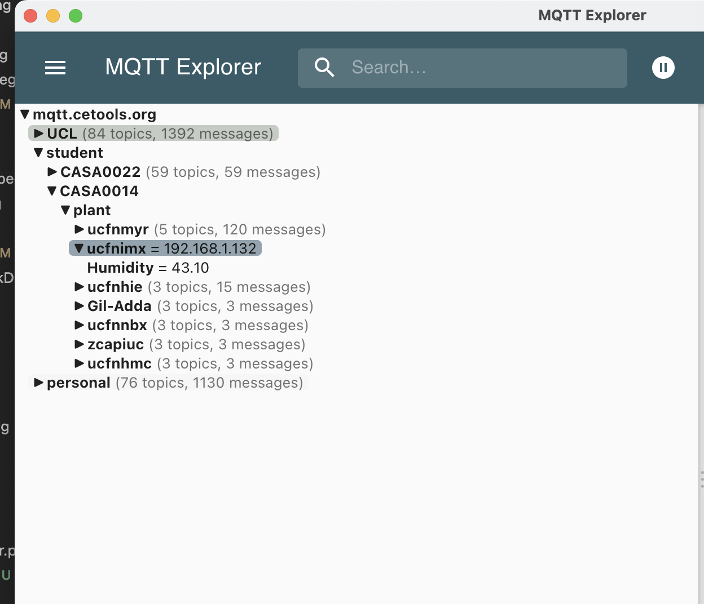

# Plant Monitor

### Ficus microcarpa moclame


* * *

## 1\. Project Overview
The project is developing the plant monitor collecting and visualising the factors affecting growth.  I will monitor [Ficus microcarpa Moclame](https://www.rhs.org.uk/plants/164300/ficus-microcarpa-moclame-(pbr)/details) using various components, for example, [Adafruit](https://learn.adafruit.com/adafruit-feather-huzzah-esp8266/overview) [Feather Huzzah ESP8266](https://learn.adafruit.com/adafruit-feather-huzzah-esp8266/overview)(Control Board), [DHT22](https://learn.adafruit.com/dht/overview)(Temperature & Humidity Sensor), [a pair of nails](https://www.instructables.com/Moisture-Detection-With-Two-Nails/) and so on. The collected data from the plant and soil will be sent to CASA [MQTT](https://en.wikipedia.org/wiki/MQTT) server, stored in [InfluxDB](https://en.wikipedia.org/wiki/InfluxDB) and visualised on [Grafana](https://en.wikipedia.org/wiki/Grafana).

  

## 2\. Understanding How Plant Grow

To get energy for growth, Plants absorb water inside the soil. By doing so, plants can absorb water and nutrients inside the soil. Then, the absorbed water goes to the leaves, and the plants use it with carbon dioxide and light for _photosynthesis_ to create chemical energy, such as carbohydrates and sugars. ([Photosynthesis - Wikipedia](https://en.wikipedia.org/wiki/Photosynthesis))


To monitor the factors affecting plant growth, It is essential to understand the mechanism of plant growth. Plant growth is generally affected by four factors. ([Environmental factors affecting plant growth | OSU Extension Service (oregonstate.edu)](https://extension.oregonstate.edu/gardening/techniques/environmental-factors-affecting-plant-growth))

Table 1 shows the growth factors and sensors to monitor how it changes.

|     |     |     |
| --- | --- | --- |
| _**Factors**_ | _**Description**_ | _**Sensors**_ |
| Light | Quantity, Quality and Duration can affect plant growth. | - [Adafruit AS7341](https://www.adafruit.com/product/4698)(Not in the project) |
| Temperature | The level of temperature affects germination, flowering and Crop Quality. | - DHT22 |
| Water and Humidity | Water inside the soil is the important ingredient for photosynthesis, and the nutrients of the soil are dissolved in it. The humidity in the air controls the transpiration of the plant. | - A pair of nails(Water in the soil)<br>-  DHT22(Humidity) |
| Plant Nutrition | Six soil elements called _macronutrients_ are largely used by plants. They are nitrogen(N), potassium(P), phosphorus(K), magnesium(Mg), calcium(Ca), and sulfur(S). | - [Soil NPK Sensor](https://www.circuitschools.com/measure-soil-npk-values-using-soil-npk-sensor-with-arduino/)(Not in the project)<br>- [Soil PH Sensor](https://www.renkeer.com/product/soil-ph-sensor/) |

Table 1. Factors of Plant Growth

## 2-1. My plant

In this project, Ficus microcarpa moclame will be monitored.

The plant is the tropical, evergreen tree. It grows up to 3m depends on an environment.

> Grow under glass or as a houseplant in a loam-based compost with added bark chippings, in full or filtered light. Water moderately and apply a high nitrogen fertiliser every four weeks during growth. Stop feeding and keep just moist over winter - [RHS](https://www.rhs.org.uk/plants/164300/ficus-microcarpa-moclame-(pbr)/details)  

Some points are important :

1. Need a lot of amount of light but it need gradual changes instead of sudden change.

- Need to check light spectrum and trend.

2. Watering required often but not in winter season.

- Measuring Moisture level in the soil need a change.
- Watering required when the top surface of the soil is dry.
- In winter season, when the soil is generally dry

3. Require adequate amount of  Humidity.

-  Need to check Humidity level and be between 40~60 %.

## 3\. Sensors in the project

Two sensors(DHT22 and a pair of nails) are used in this project. Some sensors in Table 1 are not used now but those will be equipped on the module in future.

1. DHT22

- The sensor collects temperature and humidity data every two seconds.

2. A pair of nails

- The sensor collects resistivity data of the soil. when one nail put 3.3V to soil, another nail detect it. If a moisture level of the soil is high, the electricity can easily flow between one nail to another and it shows high value.


## 4\. For the future development

As you can see in the Table 1, Light and Plant Nutrition are not covered using the current device. Especially, Light is crucial part of plant growth.

### \- Sensing Light

Why Green?

Plant use light for _photosynthesis_ **but** there are specific light spectrum that plants preferred. Usually around 400 nm range(Blue) is known as **vegetative phase range** and 650 nm range(Red) is known as **bloom and flowering phases range**. Thus, plant can die even under bright light if it is not absorbing the enough range of light.


I am testing [Adafruit AS7341](https://www.adafruit.com/product/4698) to collect light spectrum. It support 10 channels light sensing from 415 nm to 680 nm. The range is covering the target range but the **sensor is not accurate** comparing to professional equipment. **However, It is capable to check the trend of light spectrum.**

Also, the measured values can be calculated in Normalized difference vegetation index(NDVI) index.(Not exactly the same becuase NIR and Red are hard to get using this sensor.)
$${\displaystyle {{NDVI}}={\frac {({{NIR}}-{{Red}})}{({{NIR}}+{{Red}})}}}$$
@thanks to [Dhruv](https://github.com/drvkmr)


### \- External Display

Also, the collected data is not accessible without a device(Mobile Phone, Computer). Thus, an **_external display_** could help a user to understand the condition of the plant.


## 5\. Building Plant Monitor

### 5-1 .Parts List
- Adafruit Feather HUZZAH ESP8266 - Support power, processing data and transfer data to MQTT server with its WiFi module.
- DHT22 - Sensing _Temperature_(C or F) and _Humidity_(%).
- A pair of nails - Sensing _Moisture_ level of the soil by releasing electricity using Digital Pin and reading it by Analog Input Pin([ADC](https://www.arduino.cc/reference/en/language/functions/analog-io/analogread/)).
- Wires - To connect the nails with the board.
- Resistors - To use for DHT22 and Moisture sensors. The analog pin of the board can read **_up to 1.0 V._** Thus, some resistors are required to reduce 3.3V.
- Enclosure (Optional) - To make the device tidy and protect from exterior environment.
- [Plant Monitor shield designed by Prof. Duncan](https://github.com/ucl-casa-ce/casa0014/tree/main/plantMonitor) (Optional) - To remove dangling wires and for durability.


### 5-2. Wiring
#### Used pins
- 3V 
- GND
- ADC
- SPI MOSI = GPIO #13
- SPI MISO = GPIO #12
- 
The image is without the shield and enclosure and it is not limited to the image.
 https://workshops.cetools.org/codelabs/CASA0014-2-Plant-Monitor/index.html


### 5-3 . Sensing 

The code in this project has built based on [Workshop Sample Code](https://github.com/ucl-casa-ce/casa0014/tree/main/plantMonitor/code/DHT22_MQTT).

Some edits are added for the future use and to get more information.

Some snippets below are main changes from the original code.

- Collecting information from the sensors and publish to MQTT.

- Original

```
  if (minuteChanged()) {
    readMoisture();
    sendMQTT();
    Serial.println(GB.dateTime("H:i:s")); // UTC.dateTime("l, d-M-y H:i:s.v T")
  }
```

- Edit

```
    if (minuteChanged()) {
      Serial.println(GB.dateTime("H:i:s")); // UTC.dateTime("l, d-M-y H:i:s.v T")
      client.publish(topicAddress, WiFi.localIP().toString().c_str());
      float t = readDHT22(1); //Get Temperature
      float h = readDHT22(2); //Get Humidity
      float m = readMoisture(0); //Get normalised Moisture
      Serial.print("Temp:"); Serial.print(t); Serial.print(", ");
      Serial.print("Humid:"); Serial.print(h); Serial.print(", ");
      Serial.print("SoilMoist:"); Serial.print(m); Serial.print(", ");
      Serial.println();
      //Send collecting data to MQTT
      sendMQTT("Temperature", t);
      sendMQTT("Humidity", h);
      sendMQTT("Moisture", m);
      delay(2000);
   }
```

  

- Reading Moisture Level of Soil

    - Original

```
void readMoisture(
){
  
  // power the sensor
  digitalWrite(sensorVCC, HIGH);
  digitalWrite(blueLED, LOW);
  delay(100);
  // read the value from the sensor:
  Moisture = analogRead(soilPin);         
  digitalWrite(sensorVCC, LOW);  
  digitalWrite(blueLED, HIGH);
  delay(100);
  Serial.print("Wet ");
  Serial.println(Moisture);   // read the value from the nails
}

```

- Edit

```
//Read the Moisture sensor and return value
//Nomalised Value = 0, Raw Value = 1
float readMoisture(int mode){
  // power the sensor
  digitalWrite(sensorVCC, HIGH);
  digitalWrite(blueLED, LOW);
  delay(100);
  // read the value from the sensor:
  float moist = analogRead(soilPin);         
  digitalWrite(sensorVCC, LOW);  
  digitalWrite(blueLED, HIGH);
  delay(100);
  if(mode == 0){
    Serial.println(moist);
    return tanh(map(moist, 1, 500, 0, 3)) * 100; //For General
    // return tanh(map(moist, 1, 300, 0, 3)) * 100; //For winter season
  }else{
    return moist;
  };
}

```


- Added the function to get data from DHT22

```
//Read DHT22 sensor and return value
//temperature = 1, humidity = 2
float readDHT22(int mode){
  switch (mode)
  {
  case 1:
    DHTValue = dht.readTemperature(); // Gets the values of the temperature
    return DHTValue;
    break;
  case 2:
    DHTValue = dht.readHumidity(); // Gets the values of the humidity
    return DHTValue;
    break;
  default:
    Serial.print("DHT22 mode error : Select from 'temperature' or 'humidity'.");
    DHTValue = -1;
    return DHTValue;
    break;
  }
}

```

  

- Check WiFi connection status

    - Original

```
void startWifi() {
  // We start by connecting to a WiFi network
  Serial.println();
  Serial.print("Connecting to ");
  Serial.println(ssid);
  WiFi.begin(ssid, password);

  // check to see if connected and wait until you are
  while (WiFi.status() != WL_CONNECTED) {
    delay(500);
    Serial.print(".");
  }
  Serial.println("");
  Serial.println("WiFi connected");
  Serial.print("IP address: ");
  Serial.println(WiFi.localIP());
}

```

- Edit

```
  // check to see if connected and wait until you are
  while (WiFi.status() != WL_CONNECTED) {
    switch (WiFi.status()) {
      case WL_NO_SSID_AVAIL:
        Serial.print(ssid);
        Serial.println(" - Not Exist.");
        break;
      case WL_CONNECT_FAILED:
        Serial.print(ssid);
        Serial.println(" - Connection Fail.");
        break;
      case WL_CONNECTION_LOST:
        Serial.print(ssid);
        Serial.println(" - Connection List.");
        break;
      case WL_WRONG_PASSWORD:
        Serial.print(ssid);
        Serial.println(" - Wrong Password.");
        break;
      case WL_DISCONNECTED:
        Serial.print(ssid);
        Serial.println(" - Disconnected.");
        break;
      default:
        Serial.print(ssid);
        Serial.println(" - Error(Default Code).");
        break;
    }
    delay(1000);
    Serial.print("Connecting...");
  }

```


  

- sendMQTT() changed to send MQTT data only.

    - Original

```
void sendMQTT() {

  if (!client.connected()) {
    reconnect();
  }
  client.loop();

  Temperature = dht.readTemperature(); // Gets the values of the temperature
  snprintf (msg, 50, "%.1f", Temperature);
  Serial.print("Publish message for t: ");
  Serial.println(msg);
  client.publish("student/CASA0014/plant/ucfnimx/temperature", msg);

  Humidity = dht.readHumidity(); // Gets the values of the humidity
  snprintf (msg, 50, "%.0f", Humidity);
  Serial.print("Publish message for h: ");
  Serial.println(msg);
  client.publish("student/CASA0014/plant/ucfnimx/humidity", msg);

  //Moisture = analogRead(soilPin);   // moisture read by readMoisture function
  snprintf (msg, 50, "%.0i", Moisture);
  Serial.print("Publish message for m: ");
  Serial.println(msg);
  client.publish("student/CASA0014/plant/ucfnimx/moisture", msg);

}
```

 - Edit

```
bool sendMQTT(char* topic, float value) {
  if (!client.connected()) {
    reconnect();
  }
  client.loop();
  if(isRepeated(topic, value)){ //Check whether the same value was sent just before
    Serial.print(topic);
    Serial.println(" - Same Value Detected.");
    return false;
  }else{
    dtostrf(value, 7, 2, msg); //Change float type to char type
    char sendingAddress[20];
    strcpy(sendingAddress, topicAddress); //Get MQTT address and save
    strcat(sendingAddress, "/");
    strcat(sendingAddress, topic);  //append topic in the address
    client.publish(sendingAddress, msg);  //Send to MQTT
    return true;
  }
}

```

```
bool isRepeated(char* topic, float value){
  if(topic == "Humidity"){
    if(Humidity == value){
      return true;
    }else{
      Humidity = value;
      return false;
    }
  }else if (topic == "Temperature"){
    if(Temperature == value){
      return true;
    }else{
      Temperature = value;
      return false;
    }
  }else{
    if(Moisture == value){
      return true;
    }else{
      Moisture = value;
      return false;
    }
  }
}

```

  

- Add some meme and data in the local webpage.

    - Original

```
  ptr += "<p>Temperature: ";
  ptr += (int)Temperaturestat;
  ptr += " C</p>";
  ptr += "<p>Humidity: ";
  ptr += (int)Humiditystat;
  ptr += "%</p>";
  ptr += "<p>Moisture: ";
  ptr += Moisturestat;
  ptr += "</p>";
  ptr += "<p>Sampled on: ";
  ptr += GB.dateTime("l,");
  ptr += "<br>";
  ptr += GB.dateTime("d-M-y H:i:s T");
  ptr += "</p>";

```

- Edit

```
  ptr += "<p>Temperature: ";
  ptr += Temperaturestat;
  ptr += " C</p>";
  if(Temperaturestat < 20){
    ptr += "\n";
  }else{
    ptr += "\n";
  }
  ptr += "<p>Humidity: ";
  ptr += Humiditystat;
  ptr += "%</p>";
  if(Humiditystat < 45){
    ptr += "\n";
  }else{
    ptr += "\n";
  }
  ptr += "<p>Moisture: ";
  ptr += Moisturestat;
  ptr += "</p>";
  if(Moisturestat < 0.5){
    ptr += "\n";
  }else{
    ptr += "\n";
  }
  ptr += "<p>Sampled on: ";
  ptr += GB.dateTime("l,");
  ptr += "<br>";
  ptr += GB.dateTime("d-M-y H:i:s T");
  ptr += "</p>";

```


  

  

  

## 6\. To do

1. Add the light sensor.
2. Add the external display.
3. Update the enclosure.
4. Update the moisture measuring method.
  

Virtual Plant Monitor displaying live MQTT data.

## 0\. Reference

[Moisture Detection With Two Nails : 3 Steps - Instructables](https://www.instructables.com/Moisture-Detection-With-Two-Nails/)  

[Photosynthesis - Wikipedia](https://en.wikipedia.org/wiki/Photosynthesis)  

[Environmental factors affecting plant growth | OSU Extension Service (oregonstate.edu)](https://extension.oregonstate.edu/gardening/techniques/environmental-factors-affecting-plant-growth)  

[Soil resistivity - Wikipedia](https://en.wikipedia.org/wiki/Soil_resistivity#:~:text=Soil%20resistivity%20is%20a%20measure,current%20through%20the%20Earth's%20surface.)  

[Making a Plant Monitor – UCL Connected Environments (connected-environments.org)](https://connected-environments.org/making/plant-monitor/)  

[What is Photosynthetically Active Radiation? (byjus.com)](https://byjus.com/neet/photosynthetically-active-radiation/)  

[Overview | Adafruit AS7341 10-Channel Light / Color Sensor Breakout | Adafruit Learning System](https://learn.adafruit.com/adafruit-as7341-10-channel-light-color-sensor-breakout/overview)  

[analogRead() - Arduino Reference](https://www.arduino.cc/reference/en/language/functions/analog-io/analogread/)  

[casa0014/plantMonitor at main · ucl-casa-ce/casa0014 (github.com)](https://github.com/ucl-casa-ce/casa0014/tree/main/plantMonitor)

[09: WebGL and WebXR (cetools.org)](https://workshops.cetools.org/codelabs/CASA0017-week-09/index.html?index=..%2F..index#12)

[Normalized difference vegetation wikipedia](https://en.wikipedia.org/wiki/Normalized_difference_vegetation_index)